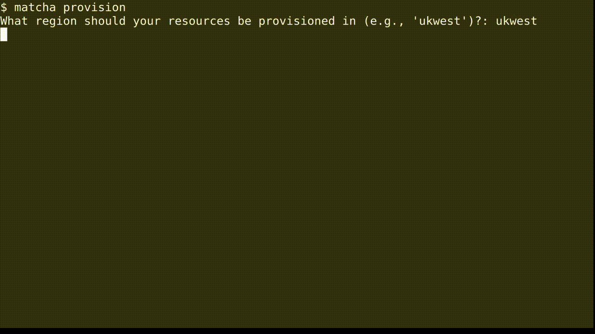

<h1 align="center">
    </img>
</h1>

    
    
    
    

<h3 align="center">
    
Open source MLOps on Azure in one step

</h3>

If you train machine learning models, then you know the challenge of going from _experiment_ to _production_. There's a vast range of tools that promise to help, from experiment tracking through to model deployment, but setting these up requires a lot of time and cloud engineering knowledge.

**Matcha removes the complexity of provisioning your machine learning infrastructure**. With one step, you'll have a complete _machine learning operations (MLOps)_ stack up and running in your Microsoft® Azure cloud environment. This means you'll be able to track your experiments, train your models, as well as deploy and serve those models.

    </img>

# &#127861; Who is Matcha for?

Matcha is for data scientists, machine learning engineers, and anybody who trains machine learning models. If you're using Azure, and want an intuitive way to deploy machine learning infrastructure, Matcha is for you.

# &#127939; How do I get started?

If you're new to Matcha, the best place to start is [our guide to deploying your first model](http://www.mymatcha.ai/getting-started). If you're happy with the basics, then you might want to dive into our [Matcha examples](https://github.com/fuzzylabs/matcha-examples) on Github.

## &#128214; Documentation

The full Matcha documentation can be found at [mymatcha.ai](https://mymatcha.ai). This covers what Matcha is in more detail, how to use it, what Azure permissions are required, and how Matcha works internally.

## &#128506;&#65039; Roadmap

We've put a lot of thought into what our users — data scientists, ML engineers, etc — need from their infrastructure, and we came up with 5 key pieces of functionality that are absolute musts:

* A place to track, version, and manage datasets.
* A place to track experiments and models assets.
* Scalable compute for running training workloads, with the option to use GPUs.
* Somewhere to deploy and serve models in a way that scales with your application needs.
* The ability to monitor models for things like drift and bias.

Matcha is still in alpha release, and we don't support everything on that list yet. We support experiment tracking, training, and deployment, with plans to add data versioning and monitoring later. We very much welcome input on our roadmap from our early users.

## &#128079; Contributing

Matcha at its very core is open source and we're eager for you to get involved whether through raising issues or by opening a PR.

We have an in-depth [contributing](CONTRIBUTING.md) guide which will describe how to do all of this.

> Note: Matcha is still in alpha release. While we've worked hard to ensure there are no defects, there's a small chance that you'll find a bug or something that hasn't been documented as well as it could be. If that happens, we'd really value your feedback, which you can send by submitting an [issue](https://github.com/fuzzylabs/matcha/issues/new/choose) to Matcha on Github.

## &#128220; License

This library is released under the Apache License. See [LICENSE](LICENSE).

# &#129309; Acknowledgements

Thank you to [ZenML](https://zenml.io/home) for their contributions and inspiration through their [stack recipes](https://github.com/zenml-io/mlops-stacks).
