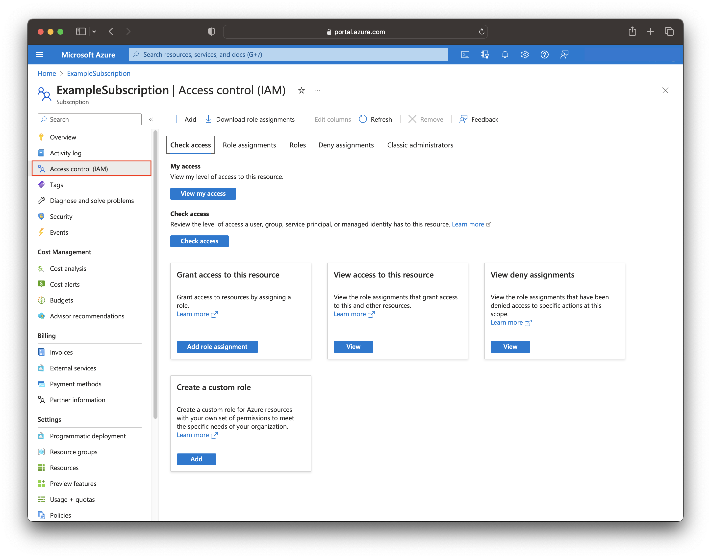
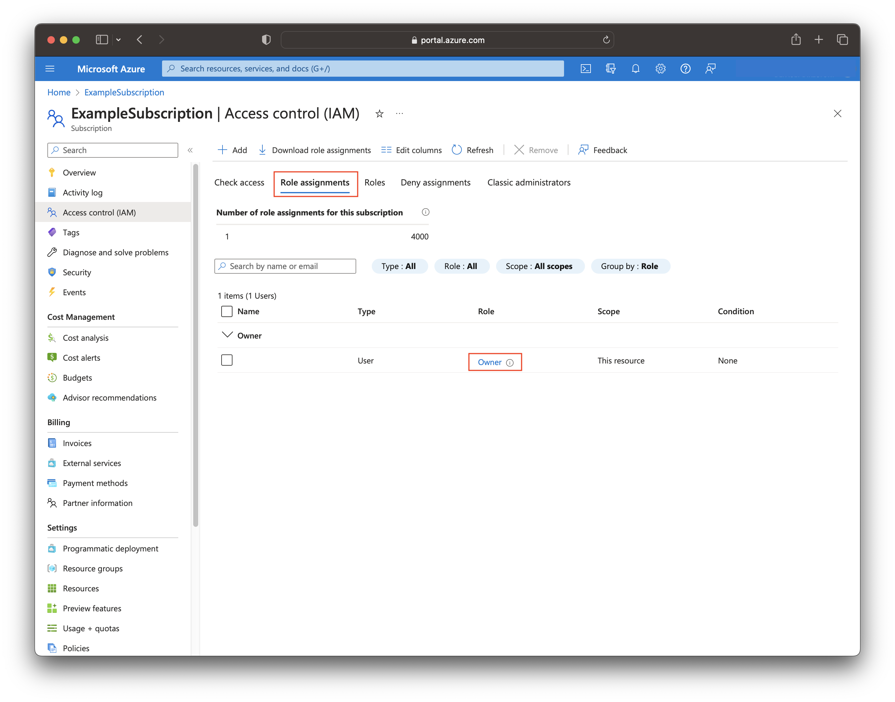
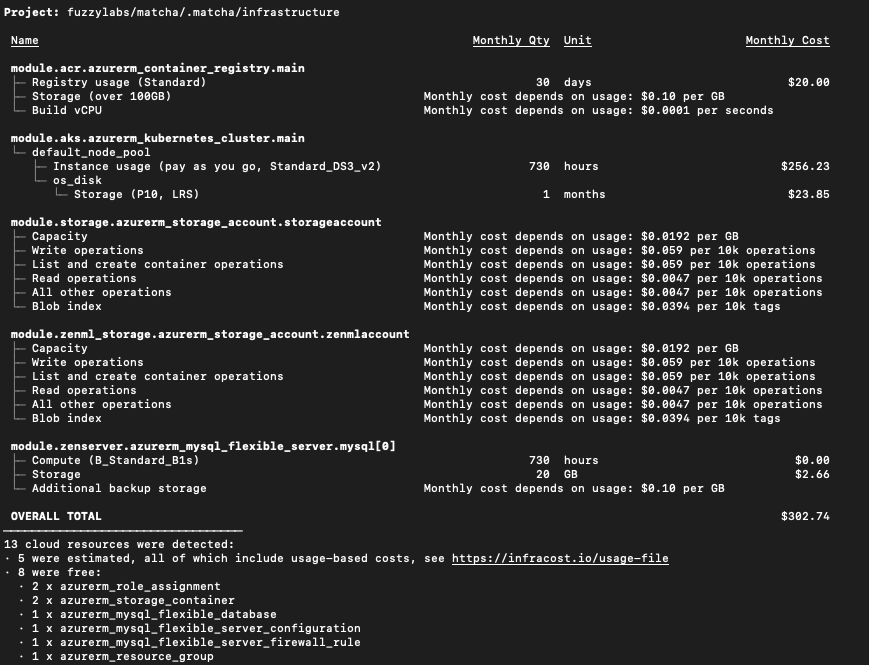

# Azure Permissions

Before getting started with `matcha`, we need to make sure that you have the correct permissions to provision resources on Azure.

There is a presumption made here that you have an Azure account with an active subscription which has billing enabled. For a guide on how to set that up, see [here](https://learn.microsoft.com/en-us/dynamics-nav/how-to--sign-up-for-a-microsoft-azure-subscription).

## Why does `matcha` require certain permissions?

As a provisioning tool, `matcha` interacts with Azure on your behalf, hiding away the complexities of standing up resources. To do the provisioning, `matcha` issues commands through your Azure account and to do that, your account needs to have the correct permissions enabled within a subscription.

## What permissions does `matcha` require?

In its current form, the following Azure permissions are required:

1. Owner
2. A combination of: Contributor + User Access Administrator

> Note: These are high level roles with a lot of privilages and we're actively working on introducing more granular permissions.

## How do I check what permissions my account has?

There are two ways you can do this, one is via the [Azure CLI](https://learn.microsoft.com/en-us/cli/azure/install-azure-cli) and the other is via the [Azure Portal](https://portal.azure.com/).

### Azure CLI

To check usig the Azure CLI, do the following (replacing `<your-account-name>`):

```bash
az login
az role assignment list --assignee <your-account-name> --output json --query '[].{principalName:principalName, roleDefinitionName:roleDefinitionName, scope:scope}'
```

You should see something similar to the following (there might be multiple roles):

```bash
[
  {
    "principalName": "<your-account-name>",
    "roleDefinitionName": "Owner",
    "scope": "/subscriptions/<uuid>"
  }
]
```

Check the `roleDefinitionName` field and if eithe rof the two roles [defined above](#what-permissions-does-matcha-require) are present, then you have the correct level of permissions to run `matcha provision`.

### Azure Portal

To check your permissions using the Azure portal, do the following:

- In the Azure portal, go to *Subscriptions*
- Select the subscription that you want to check the roles for
- Click *Access Control (IAM)* in the panel to the left

<figure markdown>
  
  <figcaption>Azure Access Control</figcaption>
</figure>

- Go to the *Role assignments* tab
- Check in the *Role* column whether it matches one of the [required roles](#what-permissions-does-matcha-require)

<figure markdown>
  
  <figcaption>Azure Role Assignments</figcaption>
</figure>

From the above, we can see that the user has the Owner permissions.

## How much does it cost?

`matcha` deploys a set of resources to Azure for you, so a natural question is: what on earth is this going to cost?! Below is how much it would cost to run the provisioned resources on Azure for a month.

<figure markdown>
  
  <figcaption>Azure Cost Breakdown</figcaption>
</figure>

This is a minimal setup and we've minimised the amount of resources where possible, reducing the overall cost. It's worth noting that if you don't have an Azure account, new joiners get Azure Credit which more than covers the cost of deploying these resources for exploring `matcha`.

Our advice would be to make use of the `matcha destroy` command which will deprovision resources for you.
