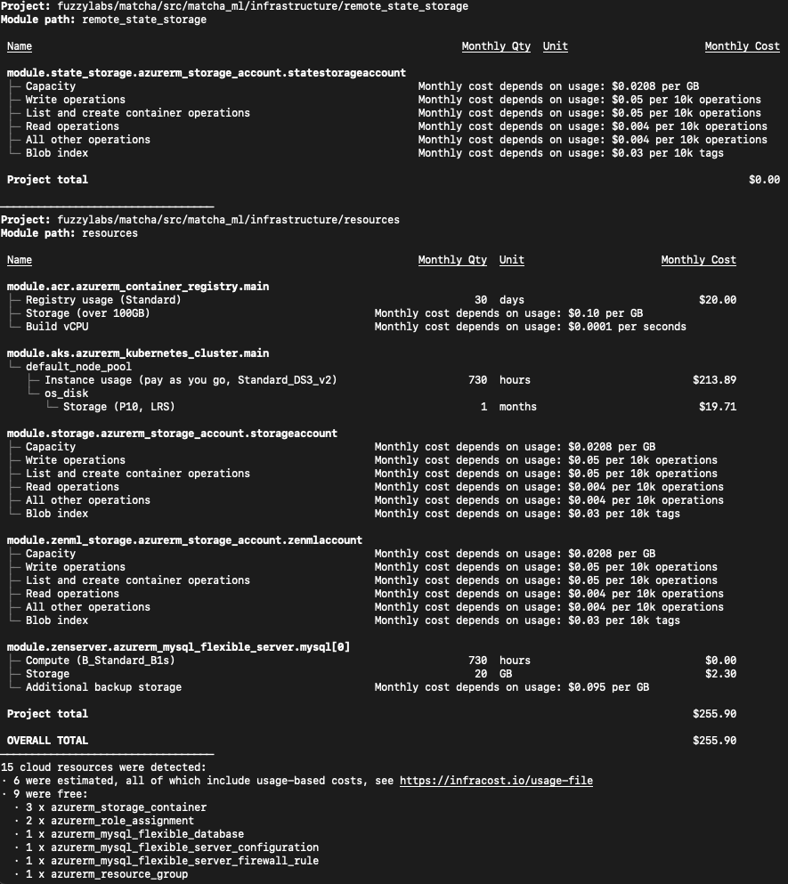

# Cost

Matcha deploys a set of resources to Azure for you, so a natural question is: what is this going to cost? Below is how much it would cost to run the provisioned resources on Azure for a month.

<figure markdown>
  
  <figcaption>Azure Cost Breakdown</figcaption>
</figure>

This is a minimal setup and we've minimized the amount of resources where possible, reducing the overall cost. It's worth noting that if you don't have an Azure account, new joiners get Azure Credit which more than covers the cost of deploying these resources for exploring Matcha.

Our advice would be to make use of the `matcha destroy` command which will deprovision resources for you.
