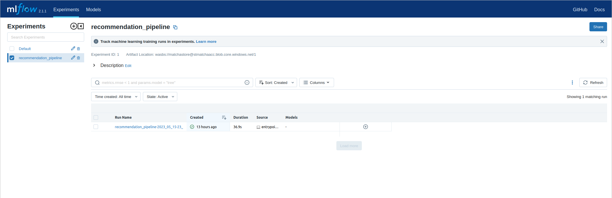

# Deploying your first model with Matcha

In this guide, we'll walk you through how to provision your first machine learning infrastructure to Azure, and then use that infrastructure to train and deploy a model. The model we're using is a movie recommender, and we picked this because it's one that beginners can get up and running with quickly.

There are five things we'll cover:

* [Pre-requisites](#pre-requisites): everything you need to set up before starting.
* [The movie recommender](#the-movie-recommender): downloading the example code and setting up your Python environment
* [Provisioning](#provisioning): Using Matcha to provision your infrastructure
* [Sharing Resources](#sharing-resources): Sharing resources with other people
* [Training and deploying](#training-and-deploying): training a model on your provisioned infrastructure, deploying, and testing it
* [Destroying](#destroying): tearing down provisioned infrastructure

The movie recommender is one among several of example workflows that we've made available on Github; you can view all our examples [here](https://github.com/fuzzylabs/matcha-examples).

> Note: Matcha is still in alpha release. While we've worked hard to ensure there are no defects, there's a small chance that you'll find a bug or something that hasn't been documented as well as it could be. If that happens, we'd really value your feedback, which you can send by submitting an issue to Matcha on Github.

# Pre-requisites

## An Azure cloud environment

Matcha uses Azure to provision your infrastructure, so first you'll need to set up a [Microsoft® Azure account](https://azure.com).

## Tools you'll need

Next, you'll need to install a couple of things.

* Python 3.8 or newer, along with Virtual Env and PIP.
* The Azure command line tool. Instructions on installing this can be found [here](https://learn.microsoft.com/en-us/cli/azure/install-azure-cli).
* Terraform. We use this to provision services inside Azure. You'll find installation instructions for your platform [here](https://developer.hashicorp.com/terraform/downloads?product_intent=terraform). We recommend version 1.4 or newer.

# The movie recommender

Matcha has an [examples repository](https://github.com/fuzzylabs/matcha-examples) on Github, and that's what we'll be working from in this guide. There are a number of different examples in that repository, but we'll focus on the movie recommender. Note, however, that all the examples have been designed to work in much the same way as this one.

Start by cloning the examples repository:

```bash
git clone https://github.com/fuzzylabs/matcha-examples.git
```

Then, enter the `recommendation` directory and set up your Python environment:

```bash
cd recommendation
python3 -m venv venv
source venv/bin/activate
```

Now, let's install Matcha:

```bash
pip install matcha-ml
```

You can test that your installation is working by running

```bash
matcha --version
```

Which should reply with something like `Matcha version: <version number>`.

Now you're ready to provision your infrastructure.

# Provisioning

Using the Azure CLI, you will need to authenticate:

```bash
az login
```

When you run this command, you'll be taken to the Azure login screen in a web browser window, and you'll be asked if you want to allow the Azure CLI to access your Azure account. You'll need to grant this permission in order for Matcha to gain access to your Azure account when it provisions infrastructure.

> Note: you'll need certain permissions in order for Matcha to work. If you're unsure, you can just run `matcha` and it will tell you if you're missing any permissions. For specifics around permissions, please see our explainer on [Azure Permissions](azure-permissions.md).

Next, let's provision:

```bash
matcha provision
```

Initially, Matcha will ask you a few questions about how you'd like your infrastructure to be set up. Specifically, it will ask for a _name_ for your infrastructure, a _region_ to deploy it to. Once these details are provided, Matcha will proceed to initialize a remote state manager and ask for a password. After that, it will go ahead of provision infrastructure.

> Note: provisioning can take up to 20 minutes.

Once provisioning is completed, you can query Matcha, using the `get` command:

```bash
matcha get
```

You should have something similar to the following output:

```bash
Cloud
   - flavor: azure
   - resource-group-name: example-resources

Container registry
   - flavor: azure
   - registry-name: crexample
   - registry-url: <url>

Experiment tracker
   - flavor: mlflow
   - tracking-url: <url>

Model deployer
   - flavor: seldon
   - base-url: <url>
   - workloads-namespace: matcha-seldon-workloads

Orchestrator
   - flavor: aks
   - k8s-context: terraform-example-k8s

Pipeline
   - flavor: zenml
   - connection-string: ********
   - server-password: ********
   - server-url: <url>
   - server-username: ********
   - storage-path: az://<path>
```

You can also use `get` to inspect specific resources, for example:

```bash
matcha get experiment-tracker
```

With the following output:

```bash
Below are the resources provisioned.

Experiment tracker
   - flavor: mlflow
   - tracking-url: <url>
```

> Note: You can also get these outputs in either json or YAML format using the following: `matcha get --output json`

By default, Matcha will hide sensitive resource properties. If you need one of these properties, then you can add the `--show-sensitive` flag to your `get` command.

# &#129309; Sharing resources

You'll notice that a configuration file is create as part of the provisioning process - it's called `matcha.config.json`. This file stores the information necessary for Matcha to identify the resource group and storage container that holds the details of the provisioned resources.

When Matcha provision first runs, it creates a storage blob in Azure which holds details of the provisioned environment. For more detail, please see our [Inside Matcha > How does Matcha work](inside-matcha.md) section.

In order to access your provisioned resources, other users will need to ensure this configuration file exists locally, in the same directory where the file was originally created. We suggest that the matcha.config.json file be included within the project repository and shared using GitHub or similar repository hosting tools. The user will also have to:

1. Set the active Azure subscription to the one that contains the resource group.
2. Ensure they have access to both the resource group and the storage bucket.

> Note: the shared file does not contain any sensitive information such as passwords or server endpoints.

Matcha uses this file to find and pull the provisioned state information, which will allow multiple users to use the same provisioned resources.

<div align="center">
    </img>
</div>


# Training and deploying

Now that you've reached this point, you'll have provisioned the following infrastructure into Azure:

* The MLFlow experiment tracker and model registry.
* Seldon for model deployment and serving.
* A ZenML server. This example uses ZenML for defining and orchestrating the training and deployment pipelines.
* Kubernetes. This has two roles: firstly, it's where the training workload actually runs, and secondly it's the deployment environment for all of the above components.

## Setup

## Setting up

Before you can train the model, there's a little setup to do. We've provided a convenient script that does this for you:

```bash
./setup.sh
```

You might wonder why this setup step is necessary, and what it's doing. While you've already set Matcha up, the code that will train the model needs to know a few things about your infrastructure before it can run. As you've seen, `matcha get` is what's used to query information about your infrastructure. Under the hood, the setup script for the movie recommender model actually invokes `matcha get` to find out everything it needs to know. Additionally, this script installs some Python dependencies that are specific to the machine learning task that we're working with; crucially, the _Surprise_ library, which is part of Scikit-learn, which we're using to do the recommendation bit itself.

## Training

Once the setup script completes, you're ready to train the model:

```bash
python run.py --train
```

## Experiment tracking

Training won't take too long. After it finishes, you'll be able to view the details of this training run in MLFlow. First, look up the URL to MLFlow:

```bash
matcha get experiment-tracker
```

Copy the tracking URL into a web browser. Then, from the `experiments` pane on the left-hand side of the MLFlow interface, you'll be able to select `recommendation_pipeline`. Each time the training pipeline runs, it will be logged here, so you can view historical runs alongside important details such as the training parameters or the model performance.



## Deploying

Your model has been trained, but we can't interact with it until it has been deployed. Alongside the training pipeline, the movie recommender example includes a deployment pipeline, which will result in the model being deployed to Seldon, and made accessible as a web service.

Run

```bash
python run.py --deploy
```

Once this has completed, you can test the model out. We've included a convenience script to help with this, called `inference.py`:

```bash
python inference.py --user 100 --movie 100
```

This will result in a score, which represents how strongly we recommend movie ID `100` to user ID `100`.

## Destroying

The final thing you'll want to do is decommission the infrastructure that Matcha has set up during this guide. Matcha includes a `destroy` command which will remove everything that has been provisioned, which avoids running up an Azure bill!

```bash
matcha destroy
```

> Note that this command is irreversible will remove all the resources deployed by `matcha provision` including the resource group, so make sure you save any data you wish to keep before running this command.
