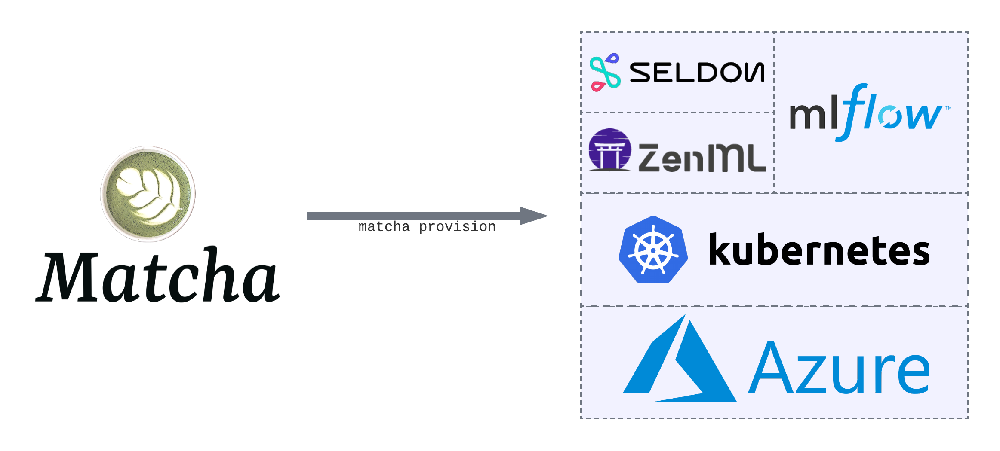

# Introduction

If you train machine learning models, then you know the challenge of going from _experiment_ to _production_. There's a vast range of tools that promise to help, from experiment tracking through to model deployment, but setting these up requires a lot of time and cloud engineering knowledge.

**Matcha removes the complexity of provisioning your machine learning infrastructure**. With one step, you'll have a complete _machine learning operations (MLOps)_ stack up and running in your Microsoft® Azure cloud environment. This means you'll be able to track your experiments, train your models, as well as deploy and serve those models.

Under the hood, Matcha leverages a number of other open souce tools: we use MLFlow to track experiments, Seldon to serve models, ZenML for orchestration, and Kubernetes for model training workloads, as well as for hosting everything else. Matcha's job is to bring together the best MLOps tooling, and set them up for you, so you can focus on training models.

Along with setting up your infrastructure, Matcha comes with a set of well-engineered examples, covering common machine learning use-cases. These examples will help you make the most out of Matcha.

# Who is Matcha for?

Matcha is for data scientists, machine learning engineers, and anybody who trains machine learning models. If you're using Azure, and want an intuitive way to deploy machine learning infrastructure, Matcha is for you.

# How do I get started?

If you're new to Matcha, the best place to start is [our guide to deploying your first model](getting-started.md).

If you're happy with the basics, then you might want to dive into our [Matcha examples](https://github.com/fuzzylabs/matcha-examples) on Github. More advanced users may be interested in learning [how Matcha works](inside-matcha.md) inside.

# Why use Matcha?

These days there are lots of MLOps platforms and tools to choose from, and you might wonder what's different about Matcha.

To begin with, it's important to say that Matcha isn't a _platform_, so it's not directly comparable to something like the Azure Machine Learning Platform, or Amazon Sagemaker. Platforms try to offer an all-in-one solution, but we see two problems with platforms: firstly, you're locked in to a particular vendor, and secondly they suffer from being a _jack of all trades, master of none_.

Open source is the solution. In designing Matcha, we've hand-picked existing tools that each do _one thing well_. Matcha's job is to deploy and manage those tools on your behalf, but there's nothing proprietory in how we do that, so you'll never be locked in.

# The Matcha roadmap

We've put a lot of thought into what our users — data scientists, ML engineers, etc — need from their infrastructure, and we came up with 5 key pieces of functionality that are absolute musts:

* A place to track, version, and manage datasets.
* A place to track experiments and models assets.
* Scalable compute for running training workloads, with the option to use GPUs.
* Somewhere to deploy and serve models in a way that scales with your application needs.
* The ability to monitor models for things like drift and bias.

Matcha is still in alpha release, and we don't support everything on that list yet. We support experiment tracking, training, and deployment, with plans to add data versioning and monitoring later. We very much welcome input on our roadmap from our early users.

# Who maintains Matcha?

Matcha is an open source project maintained by [Fuzzy Labs](https://fuzzylabs.ai), and released under the Apache 2.0 license. The greatest strength of open source is community, and we encourage our users to contribute back to the project through ideas, pull requests, and bug reports. To help out, see out [guide for contributors](https://github.com/fuzzylabs/matcha/blob/main/CONTRIBUTING.md).
