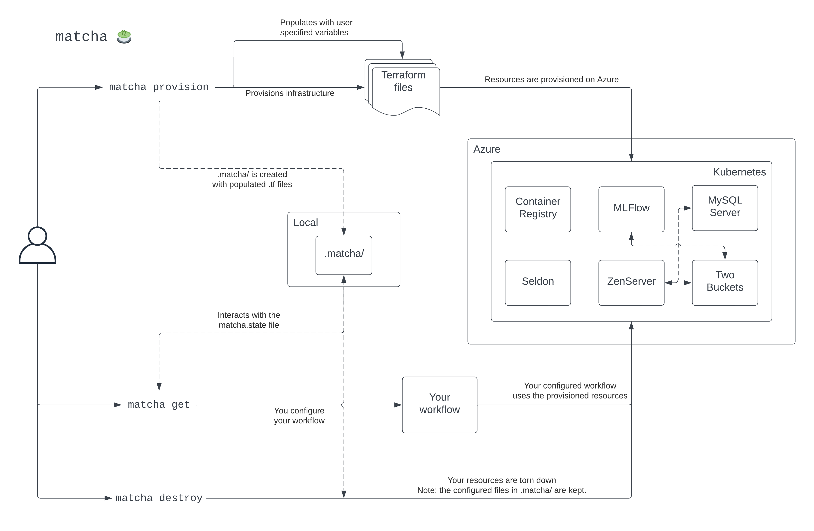

# :thinking: How does Matcha work?

Matcha is a tool that will provision an MLOps environment for you to use. To do that, we make use of various open source tools and libraries. Here, we'll provide a deep dive into how Matcha actually works.

Below is a diagram describing what happens when you use each of the commands implemented by Matcha.

<figure markdown>
  
  <figcaption>How matcha works</figcaption>
</figure>

## `provision`

Let's start with `provision`.

Fundamentally, `provision` stands up the default infrastructure that we've specified on Azure. This means that the user has to be authenticated with Azure on the command line and their account needs to have the correct level of permissions - see [here](azure-permissions.md) for a guide on this.

From a user's perspective, they're interacting with Matcha via the [typer](https://typer.tiangolo.com/) library - a great tool for designing CLI's.

When `provision` is run by the user, we take their input (the `region` and `prefix`) and populate a set of Terraform files - our hand crafted sensible defaults defined as infrastructure-as-code. Once we have the populated Terraform files, Matcha calls `init` (via the [python-terraform](https://github.com/beelit94/python-terraform) library) to download the information we need from Azure which is used for deploying infrastructure. Immediately after, `apply` is run which deploys the infrastructure defined in the Terraform files to Azure.

After completing the provisioning process on Azure, the output information of the remote state manager is stored in a `matcha.config.json` file in the project root directory. Additionally, information about the provisioned resources, along with the populated Terraform files, is stored in a `matcha.state` file within a `.matcha/infrastructure` directory.

At this point, users have access to the provisioned resources and can utilise them as needed.

To enable multiple users to use the same set of provisioned resources, the user will need to upload the `matcha.config.json` file to the project's GitHub repository. This ensures that everyone has access to the up-to-date information regarding Matcha's current state.

## `get`

Through `get`, the user can fetch information about their provisioned resources. Matcha `get` interacts with the `matcha.state` file, which is stored locally and in the cloud. The local `matcha.state` file will be synchronised with the cloud file to ensure that changes to the provisioned state are reflected in each user's environment.
The user can use `get` to request information on specific resources or properties by using the built-in arguments, and specify the format in which that information is returned by using the `--output` option. For more details, run `matcha get --help`. This enables the user to configure their workflow, for example, by getting the endpoint for their MLFlow experiment tracker.

## `destroy`

Once the user has finished with their provisioned environment, `destroy` enables them to tear down the resources. It works by calling the `destroy` Terraform command via the `python-terraform` library, which interacts with the configured Terraform files in the `.matcha/` directory.
