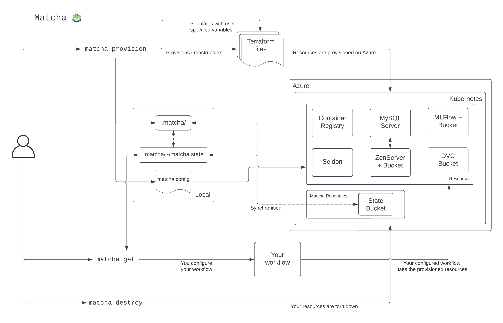

# :thinking: Inside `matcha`

`matcha` is a tool which will provision an MLOps environment for you to use. To do that, we make use of various open source tools and libraries. Here, we'll provide a deep dive into how `matcha` actually works.

Below is a diagram describing what happens when you use each of the commands implemented by `matcha`.

<figure markdown>
  
  <figcaption>How matcha works</figcaption>
</figure>

## `provision`

Let's start with `provision`.

Fundamentally, `provision` stands up the default infrastructure that we've specified on Azure. This means that the user has to be authenticated with Azure on the command line and their account needs to have the correct level of permissions - see [here](azure-permissions.md) for a guide on this.

From a user's perspective, they're interacting with `matcha` via the [typer](https://typer.tiangolo.com/) library - a great tool for designing CLI's.

When `provision` is run by the user, we take their input (the `region` and `prefix`) and populate a set of Terraform files - our hand crafted sensible defaults as infrastructure-as-code. Once we have the populated Terraform files, `matcha` calls `init` (via the [python-terraform](https://github.com/beelit94/python-terraform) library) to download the information we need from Azure which is used for deploying infrastructure. Immediately after, `apply` is run which deploys the infrastructure deinfed in the Terraform files to Azure.

Once the provisioning on Azure has completed, information about the resources are stored in a `matcha.state` file which, along with the populated Terraform files, are stored in a `.matcha/` directory.

The user is now in a position where the provisioned resources can be used.

## `get`
